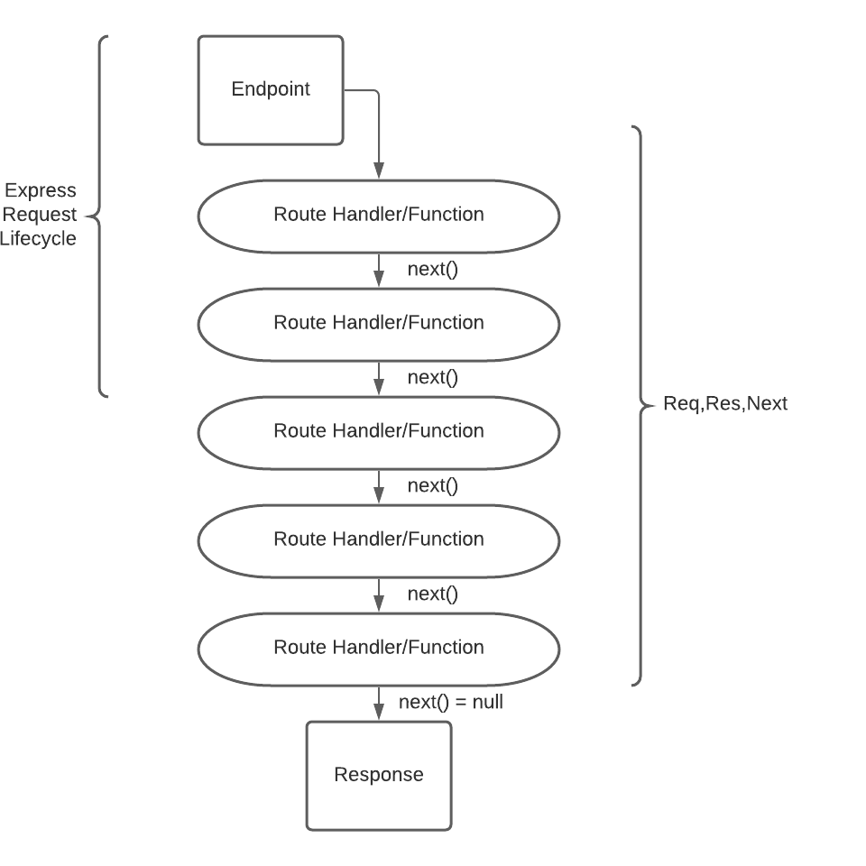

# Express Middleware

## Overview

In this lesson we'll learn how to use functions called `middleware`. Middleware is a core concept of Express and allow us great flexibility in building and structuring our servers. Middleware helps us handle different conditions during the request/response lifecycle and assists us with making our code more modular.

## Objectives

- Implement Server middleware
- Use 3rd party middleware
- Build your own middleware

## Getting Started

- Fork And Clone this repository
- `cd` into your `Express-Middleware` folder
- `npm i` or `npm install` to install the dependencies.
- `npm run dev` to check your installation completed successfully.
- Have either [Insomnia](https://insomnia.rest/download/core/?) or [Postman](https://www.postman.com/downloads/) ready to go!
  A basic Express app has been provided for you.

```js
const express = require('express')

const app = express()
const PORT = process.env.PORT || 3001
// Your Code Here

// Your Code Ends Here
app.listen(PORT, () => {
  console.log(`App listening on port: ${PORT}`)
})
```

## What is Middleware?

Middleware can be described as a function that run's in the middle of a request or before. From the Express documentation:

> Middleware functions are functions that have access to the request object (req), the response object (res), and the `next` middleware function in the application’s request-response cycle. The next middleware function is commonly denoted by a variable named next.
>
> Middleware functions can perform the following tasks:
>
> - Execute any code.
> - Make changes to the request and the response objects.
> - End the request-response cycle.
> - Call the next middleware function in the stack.



### Utilizing 3rd Party Middleware

Let's install some depedencies that we will use as `middleware`.

```sh
npm install cors body-parser
```

More on:

- [cors](https://www.npmjs.com/package/cors)
- [body-parser](https://www.npmjs.com/package/body-parser)

Once the dependencies finish installing, we'll need to `require` them in our `app.js`.

```js
const express = require('express')
const bodyParser = require('body-parser')
const cors = require('cors')

const app = express()
const PORT = process.env.PORT || 3001
// Your Code Here

// Your Code Ends Here
app.listen(PORT, () => {
  console.log(`App listening on port: ${PORT}`)
})
```

Now that we have access to these packages we can utilize them in our express app.

Luckily Express makes it super easy for us to incorporate middleware.

Express provides us with a `.use()` function that allows us to incorporate 3rd party packages.

Add the following to your `app.js` in the `your code goes here` section.

```js
app.use(cors())
app.use(bodyParser.json())
app.use(bodyParse.urlEncoded({ extended: true }))
```

By invoking the `.use()` method, we are telling our Express app to use these packages.

The `cors` package enables cross origin resource sharing for our app.
Feel free to look this up on your own time.

The `body-parser` package gives Express the ability to read various types of form data, the `json` method allows us to send json information to our server and the `urlEncoded` method allows us to send urlEncoded forms to our server.

More On the urlEncoded method here:
[bodyParser.urlEncoded](https://github.com/expressjs/body-parser#bodyparserurlencodedoptions)

We've successfully implemented 3rd party middleware with our app!

### Building Our Own Middleware

Below our 3rd party middleware, create a `GET` route for a `/middleware` endpoint:

```js
app.get('/middleware')
```

After the url, create a function and pass in 3 parameters, `request`, `response` and `next`.

```js
app.get('/middleware', (request, response, next) => {})
```

`next` is a function that tells express the call or invoke the next function.

Inside of this function let's add a `console.log` and log `this is a middleware function` and invoke the `next` function.

```js
app.get('/middleware', (request, response, next) => {
  console, log('this is middleware')
  next()
})
```

Now let's add the final function in our route. In this function pass in the `request` and `response` parameters and we'll `send` back a `reponse` with the string `request complete`.

```js
app.get(
  '/middleware',
  (request, response, next) => {
    console, log('this is middleware')
    next()
  },
  (req, res) => {
    res.send('response completed')
  }
)
```

Test this endpoint with either `insomnia` or `postman` and you'll see our `console.log` in the terminal and a response returned to your http client.

You've just built your own middleware!

## You Do

Create 4 routes, one for each `http` method. Each route should have their own middleware function that `console.log`'s the type of `http` method the route is for. Create a function after your middleware that sends a response saying: `the http type of {httpType} of request is complete`.

## Recap

In this lesson we built and utilized middleware. We implemented 3rd part middleware like `cors` and `body-parser`. We also built our own middleware functions.
Remember `middleware` functions are functions that execute as long as there is a `next` function in the request stack.

## Resources

- [Express](https://expressjs.com/)
- [Express Middleware](http://expressjs.com/en/guide/using-middleware.html#using-middleware)
